# Kusunda

## Exposition

Horizon VR

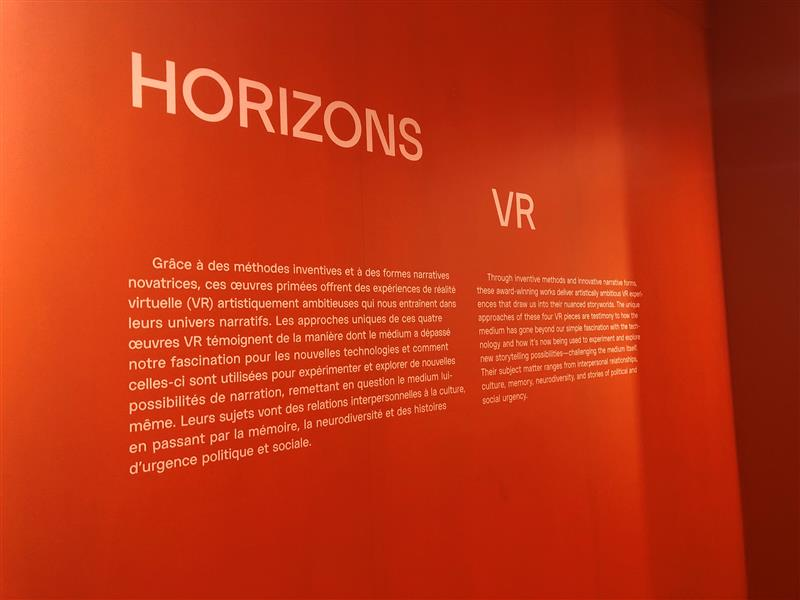

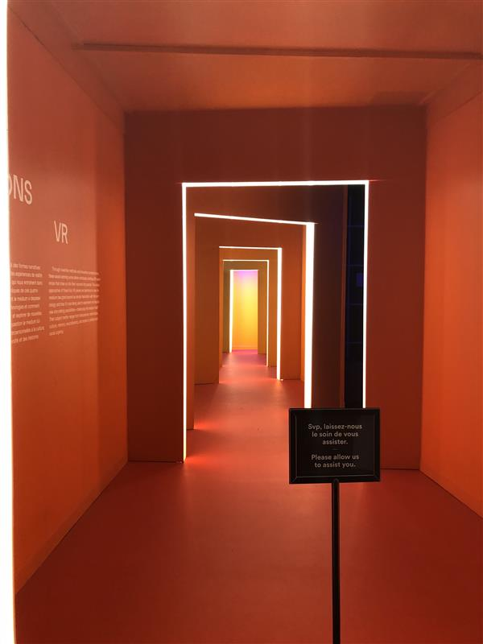

## Lieu de mise en exposition

Centre PHI, 315 Rue Saint-Paul O, au Centre d'art à Montréal

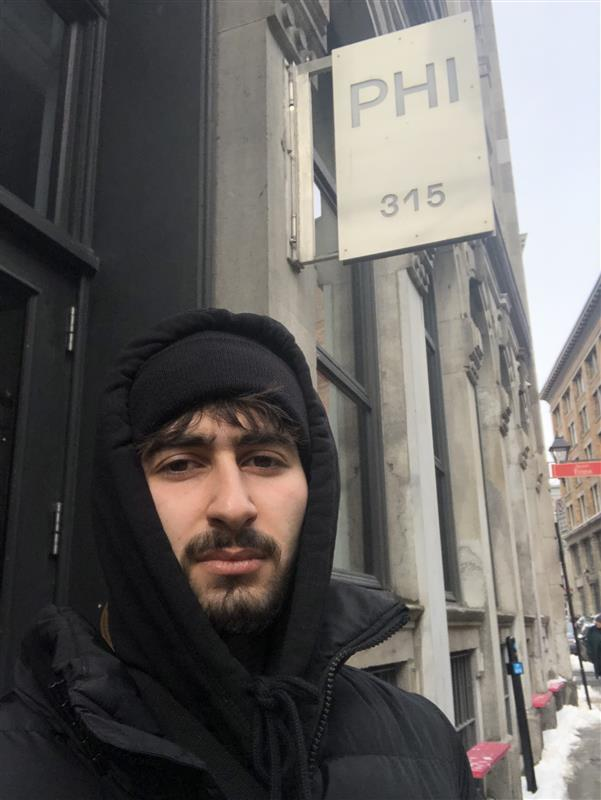

## Type d'exposition

C'est une exposition temporaire (du 30 juin jusqu'au 5 mars 2023)

## Date de la visite

La date de visite était le 1er mars 2023

## Titre de l'oeuvre

Le titre de l'œuvre est "Kusunda"

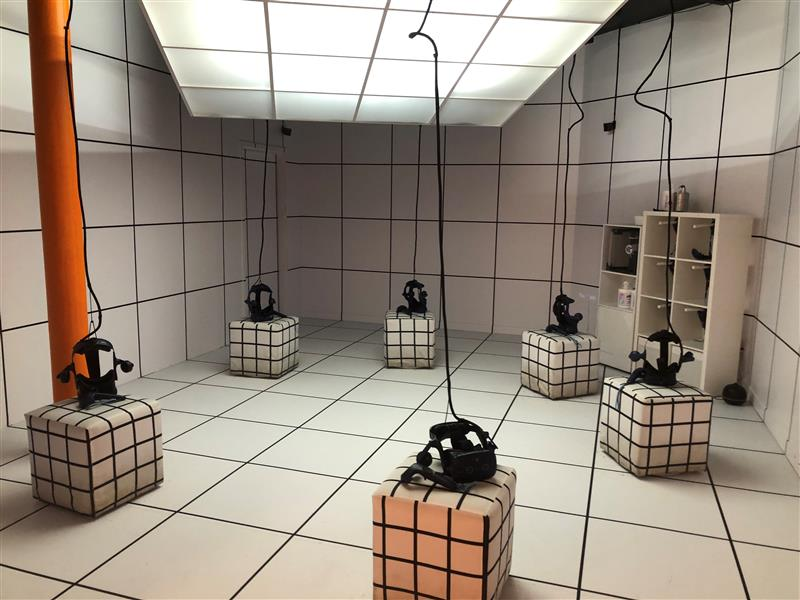

## Nom de l'artiste

Cette œuvre à été réalisée par Felix Gaedtke et Gayatri Parameswaran.

## Année de réalisation

L'oeuvre à été réaliser en 2021

## Description de l'oeuvre

Kusunda est une expérience de réalité virtuelle conduite par la voix qui explore ce qui fait qu'une langue s'efface et ce qu'il faut faire pour la revitaliser. Le chaman Kusunda Lil Bahadur a oublié sa langue maternelle indigène. Sa petite-fille, Hima, veut la faire revivre.

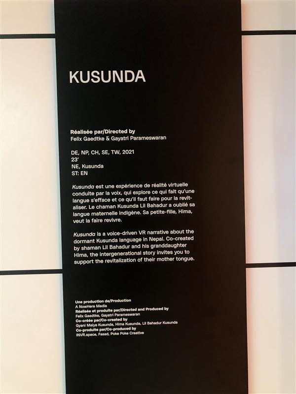

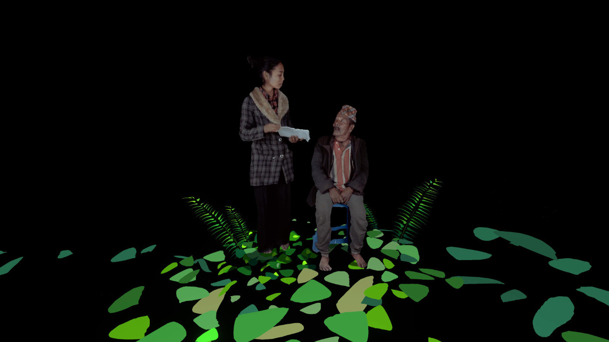

## Types d'installation

Interactive et immersive

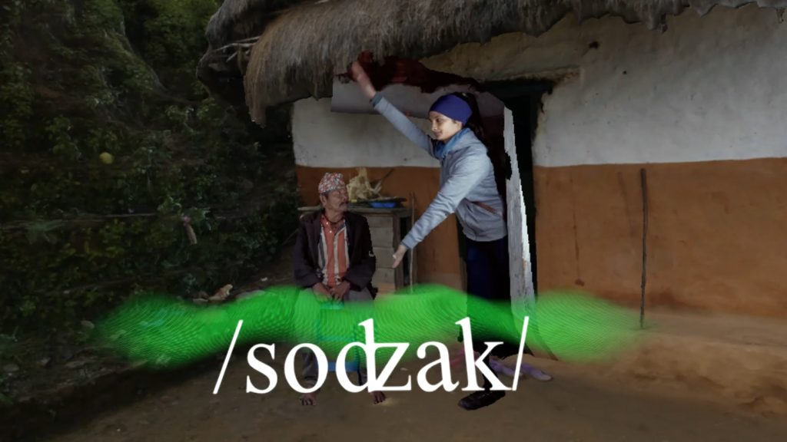

## Mise en espace

La salle est située à la fin du couloir orange avec des LEDs qui entourent chaque porte. La pièce est entièrement couvert de carreaux blancs sur le sol, le mur, le plafond, les sièges cubiques et un grand panneau lumineux. Les casques et la manette de VR sont placés sur les sièges cubiques, tandis qu'une étagère qui contient des manettes supplémentaires est disponible en cas de problème. De plus, un support de câble fixé au plafond permet de cacher les excédents de câble provenant du casque VR.

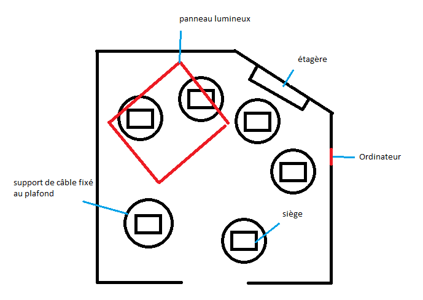

## Composantes et techniques

- Logiciels VR
- Les jeux/documentaires
- Ordinateurs

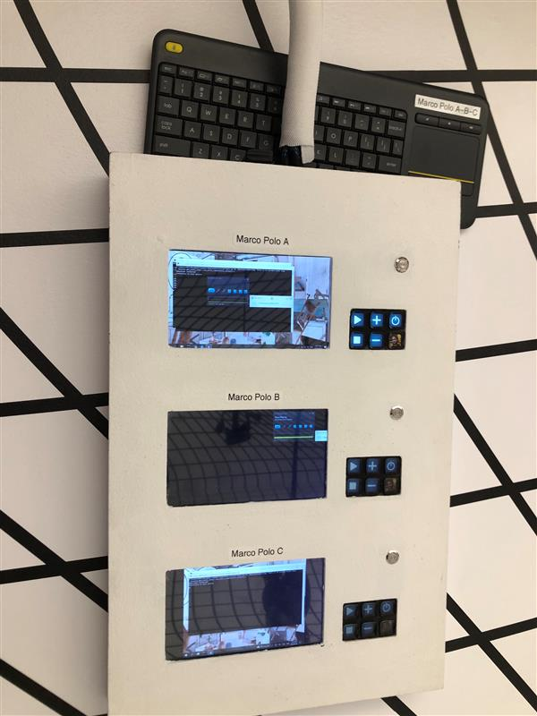

## Éléments nécessaires à la mise en exposition

- Casques et mannettes VR (6)
- Les sièges cubiques (6)
- La salle couvert de carreaux blancs
- Le panneau LED (motif carree)
- Support à cable (6)

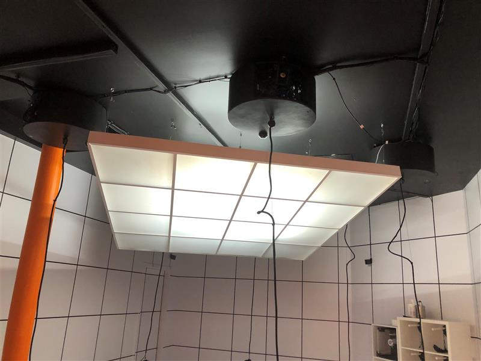

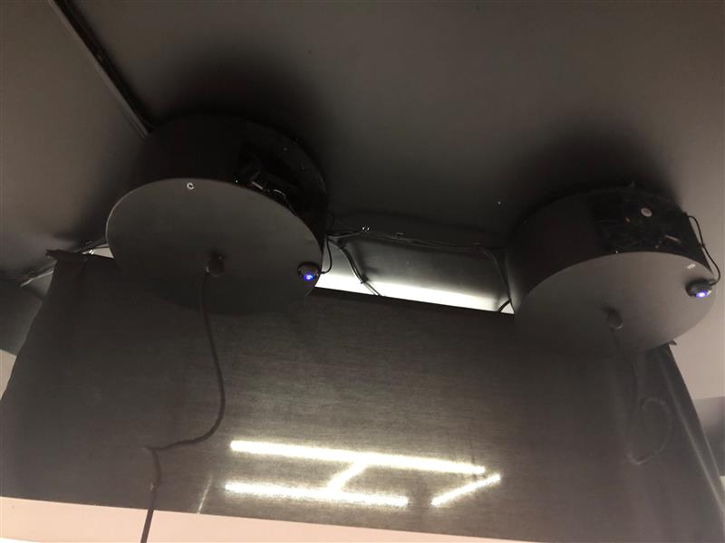

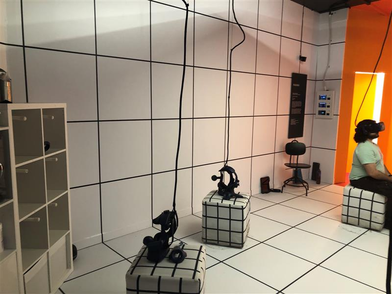

## Expérience vécue

J'ai eu une belle expérience en apprenant leur histoire grâce à de belles animations, en survolant leur village avec de magnifiques vues sur les montagnes et les forêts du Népale, et en apprenant quelques mots dans leur langue. L"application utilise intelligemment la reconnaissance vocale du casque, et en plus de cela, l'histoire racontée est vraiment charmante et positive.

## Ce qui vous a plu, vous a donné des idées

J'ai vraiment aimer la reconnaissance vocale du casque, qui permet d'interagir l'histoire de manière plus interactive. Les graphismes et les effets visuels 3D qui rend l'expérience plus réaliste et engageante. Cela nous donne aussi une nouvelle forme d'apprentissage.

## Aspect que vous ne souhaiteriez pas retenir pour vos propres créations ou que vous feriez autrement

Je pense il aurait été possible d'utiliser les salles pour d'autres œuvres, puisqu'elles sont assez plaisante visuellement et sont uniques, mais on ne les voit que pendant quelques secondes avant de passer le reste du temps sur la VR.

## Référence

- https://phi.ca/fr/evenements/horizons-vr/

- https://www.nowheremedia.net/kusundavr
